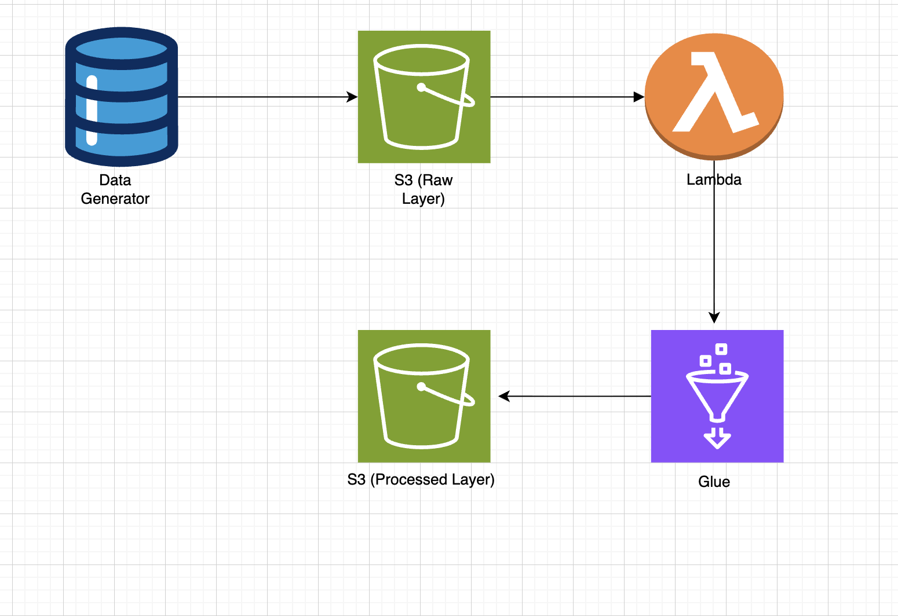

# 🚀 E-Commerce Data Pipeline (AWS)

## 📌 Overview
Designed and implemented an end-to-end event-driven data pipeline on AWS to process semi-structured e-commerce data.  
The pipeline simulates real-time data ingestion, handles schema inconsistencies, and transforms raw JSON data into analytics-ready format.

---

## 🧱 Architecture

**Flow:**
Data Generator → S3 (Raw Layer) → Lambda → AWS Glue → S3 (Processed Layer)

---

## ⚙️ Tech Stack
- **AWS S3** – Data lake storage (raw & processed layers)
- **AWS Lambda** – Event-driven orchestration
- **AWS Glue (PySpark)** – ETL processing
- **Python (boto3)** – Data ingestion automation

---

## 🔄 Workflow

1. Generated synthetic e-commerce order data using Python  
2. Uploaded data continuously into S3 (raw layer)  
3. Triggered AWS Lambda on new file uploads  
4. Invoked AWS Glue job via Lambda  
5. Processed data using PySpark:
   - Schema normalization
   - Data type conversion
   - Null handling
6. Stored cleaned data in S3 (processed layer) in Parquet format  

---

## 🔍 Key Challenges & Solutions

| Challenge | Solution |
|----------|---------|
| Schema drift (different field names) | Dynamic column mapping using PySpark |
| Mixed data types (string + numeric) | Regex-based normalization and casting |
| Missing/null values | Default value handling and filtering |
| Reprocessing of data | Implemented Glue Job Bookmarks for incremental processing |

---

## 📊 Key Features

- Event-driven architecture using S3 + Lambda  
- Fault-tolerant ETL pipeline for messy real-world data  
- Schema drift and inconsistent data handling  
- Incremental processing using Glue bookmarks  
- JSON → Parquet conversion for optimized analytics  

---

## 📈 Output

- Cleaned and structured dataset stored in S3.
